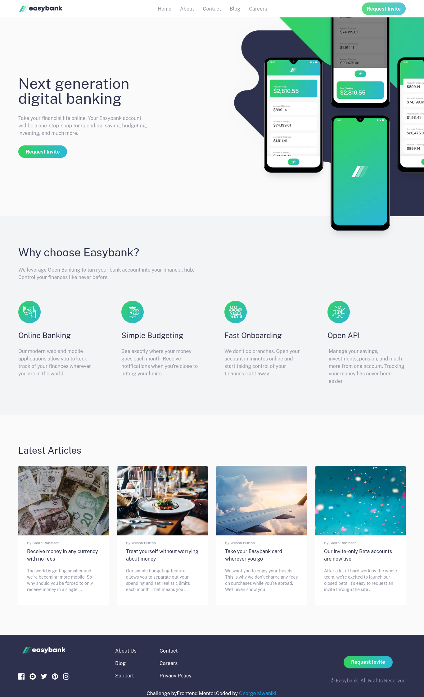

# Frontend Mentor - Easybank landing page solution

This is a solution to the [Easybank landing page challenge on Frontend Mentor](https://www.frontendmentor.io/challenges/easybank-landing-page-WaUhkoDN). Frontend Mentor challenges help you improve your coding skills by building realistic projects.

## Table of contents

- [Frontend Mentor - Easybank landing page solution](#frontend-mentor---easybank-landing-page-solution)
  - [Table of contents](#table-of-contents)
  - [Overview](#overview)
    - [The challenge](#the-challenge)
    - [Screenshot](#screenshot)
    - [Links](#links)
  - [My process](#my-process)
    - [Built with](#built-with)
    - [What I learned](#what-i-learned)
    - [Continued development](#continued-development)
    - [Useful resources](#useful-resources)
  - [Author](#author)

## Overview

### The challenge

Users should be able to:

- View the optimal layout for the site depending on their device's screen size
- See hover states for all interactive elements on the page

### Screenshot

### Links

- Solution URL: [Add solution URL here](https://your-solution-url.com)
- Live Site URL: https://easy-bank-landing-page-next.vercel.app/

## My process

### Built with

- Semantic HTML5 markup
- Tailwind CSS
- CSS Grid
- Mobile-first workflow
- [Next.js](https://nextjs.org/) - React framework

### What I learned

Through this project I learned ;

- How to build a static site with next js
- How to add tailwind to a next js site
- Setting image dimensions reduces the CLS(Cumulative layout Shift) of a page
- How to local images and fonts to next by adding them to the public folder
- Using \_document.tsx to set html lang attribute
- How to extend custom styles in tailwind
- How to setup a layout Component for a next js app

### Continued development

- I would like to improve on my usage of typescript
- I would like to set up tests

### Useful resources

- [Next js Docs](https://nextjs.org/docs/getting-started) - This helped me learn Next js from setup to best practices.
- [Tailwind Css Docs](https://tailwindcss.com/docs) - The tailwind docs were very informative and provided great examples which improved my experience.

## Author

- Frontend Mentor - [@g-nm](https://www.frontendmentor.io/profile/g-nm)
